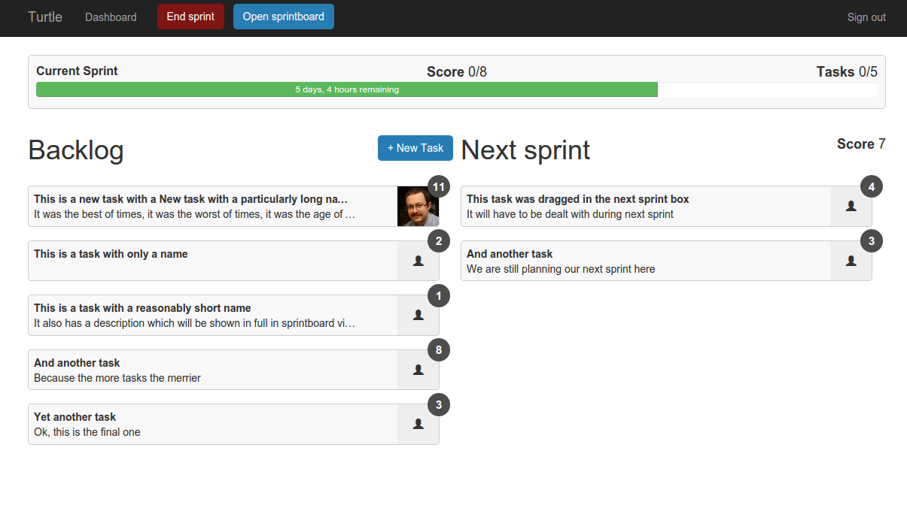
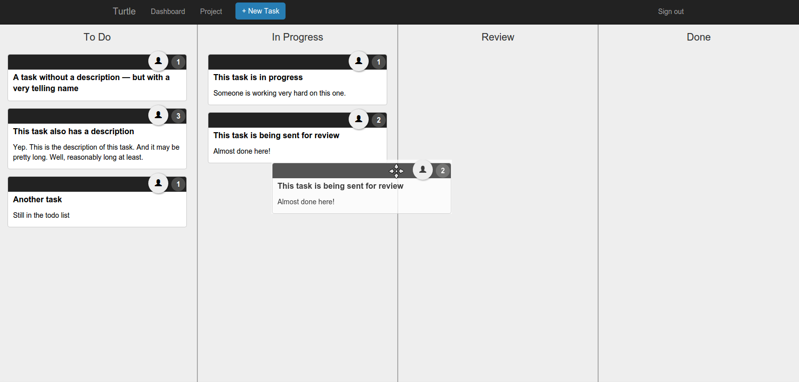

# Turtle

Turtle is an issue tracker for software developers. It is

- easy to use (tasks are controlled by dragging and dropping them around)
- built for agile development methodology
- self-sufficient (does not require third-party services to function)
- free and open-source

Turtle is written in ES6 (ES2015), and is split into several dockerized microservices (see below).
Its front end is built using React and Reflux, and also uses PostCSS for styling.

It all starts with creating a new project:


Once a project is created, the user can then start creating a backlog of tasks and planning the next sprint moving the tasks from the backlog to the next sprint area.

When a sprint is started, an indicator in the project view will show the remaining time in this sprint (default length of a sprint is 7 days):



Tasks in the current sprint are tracked in the sprint board. Dragging tasks from one column to another will indicate the task’s progress, and dragging tasks up or down the same column will change their order in that column to indicate their priority.




Check it out at [https://turtly.co](https://turtly.co)

## Getting started

1. Clone the project

  ```bash
  git clone https://github.com/the-ninja-turtles/turtle.git -b develop && cd turtle
  ```

1. Configure environment variables in .env file

  Create a .env file in the project root folder with an AUTH0_SECRET,
  AUTH0_AUDIENCE, POSTGRES_USER and POSTGRES_PASSWORD.

  ```bash
  export AUTH0_SECRET=<secret>
  export AUTH0_AUDIENCE=<audience>
  export POSTGRES_USER=<user>
  export POSTGRES_PASSWORD=<password>
  ```
  ```bash
  source .env
  ```

1. Prerequisites

  - iojs 2.3.1 (for convenient way of switching the `node` version when changing to the project directory, you can find [avn][avn] to be particularly helpful)
  - [gulp][gulp-install] has to be installed globally
  - [docker][docker-install] and [docker-compose][docker-compose-install]

1. Run the project using npm

  ```bash
  npm install
  npm test
  npm start
  ```

  The web interface should be available at [http://localhost:8080](http://localhost:8080)

Developers may find it useful to run the `gulp frontend:watch` task, which will refresh the browser every time there is a change in script or style files. This task will run [browsersync](http://www.browsersync.io/), which proxies `http://localhost:8080` to `http://localhost:3100`.

## Contribution guidelines and style guide
  - [Styleguide][styleguide]
  - [Contribution guidelines][contributing]

## Architecture and API references
  - Learn more about our [microservice][microservice] architecture and project layout
  - [Project service API][psapi] Reference
  - [Event system API][esapi] Reference

## Acknowledgements
This app has been created as a thesis project during an immersive software development course at [Hack Reactor](http://www.hackreactor.com). It was inspired by several existing project and issue trackers, such as [Waffle](https://waffle.io), [Jira](https://www.atlassian.com/software/jira), and [Taiga](https://taiga.io). The drag and drop library, [React DnD](https://github.com/gaearon/react-dnd), used on the frontend, was developed by [Dan Abramov](https://github.com/gaearon).

## License
Copyright (c) 2015, - Andrey Azov, David Craven, Wesley Tsai

Permission to use, copy, modify, and/or distribute this software for any purpose with or without fee is hereby granted, provided that the above copyright notice and this permission notice appear in all copies.

THE SOFTWARE IS PROVIDED "AS IS" AND THE AUTHOR DISCLAIMS ALL WARRANTIES WITH REGARD TO THIS SOFTWARE INCLUDING ALL IMPLIED WARRANTIES OF MERCHANTABILITY AND FITNESS. IN NO EVENT SHALL THE AUTHOR BE LIABLE FOR ANY SPECIAL, DIRECT, INDIRECT, OR CONSEQUENTIAL DAMAGES OR ANY DAMAGES WHATSOEVER RESULTING FROM LOSS OF USE, DATA OR PROFITS, WHETHER IN AN ACTION OF CONTRACT, NEGLIGENCE OR OTHER TORTIOUS ACTION, ARISING OUT OF OR IN CONNECTION WITH THE USE OR PERFORMANCE OF THIS SOFTWARE.

[styleguide]: STYLE-GUIDE.md
[contributing]: CONTRIBUTING.md
[microservice]: docs/MICROSERVICE.md
[psapi]: project-service/docs/api.md
[esapi]: event-system/docs/api.md
[avn]: https://www.npmjs.com/package/avn
[gulp-install]: https://github.com/gulpjs/gulp/blob/master/docs/getting-started.md
[docker-install]: https://docs.docker.com/installation/
[docker-compose-install]: https://docs.docker.com/compose/install/
